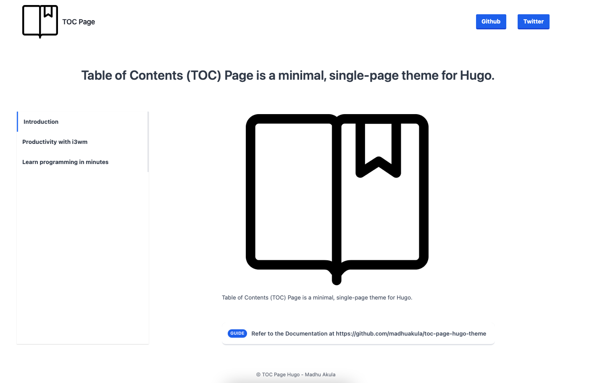

# Table of Contents (TOC) Page theme for Hugo


Table of Contents (TOC) Page is a minimal, single-page theme for Hugo.



## Get the theme

* Run from the root of your Hugo site

```sh
git clone https://github.com/madhuakula/toc-page-hugo-theme.git themes/toc-page
```

> Alternatively, you can include this repository as a [git submodule](https://git-scm.com/docs/gitsubmodules). This makes it easier to update this theme if you have your Hugo site in git as well

```sh
git submodule add https://github.com/madhuakula/toc-page-hugo-theme.git themes/toc-page
```

## Preview the theme

* toc-page theme ships with an fully configured example site. For a quick preview, run the following commands

```sh
cd themes/toc-page/exampleSite/
hugo serve --themesDir ../..
```

* Then visit `http://localhost:1313/` in your browser to view the example site

## Add content

* The following explains how to add content to your Hugo site. You can find sample content in the `exampleSite/` folder


## Configure your site

* From `exampleSite/`, copy `config.toml` to the root folder of your Hugo site and change the fields as you like

## Used By

- [Kubernetes Goat Project](https://github.com/madhuakula/kubernetes-goat)

## Issues

If you have a question, please [open an issue](https://github.com/madhuakula/toc-page-hugo-theme/issues) for help and to help those who come after you. The more information you can provide, the better!

## Contributing

Contributions are welcome. For major changes, please open an issue first to discuss what you would like to change.

## License

Licensed under [MIT](LICENSE)

## Acknowledgements

* [Varun AP](https://github.com/apvarun)
